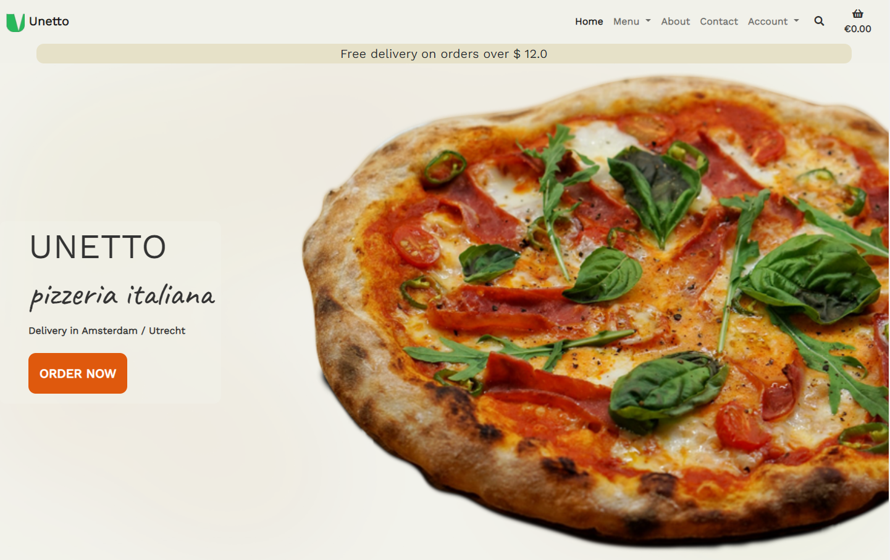
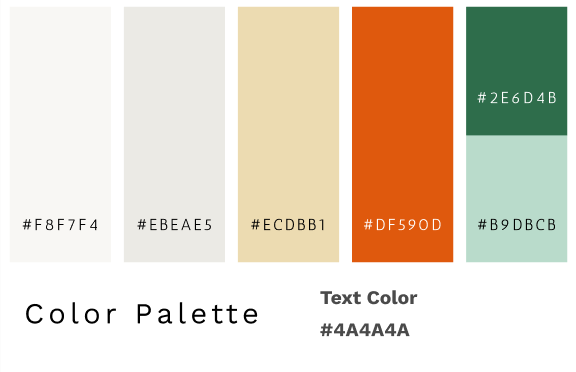
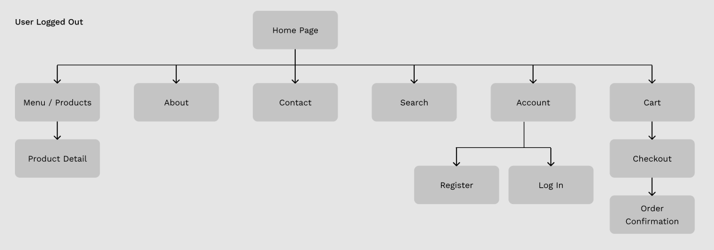
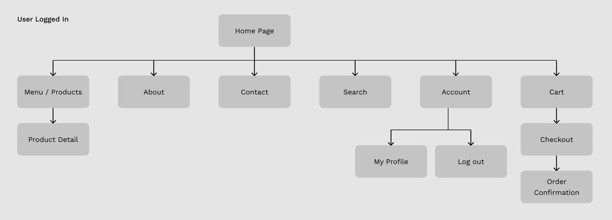
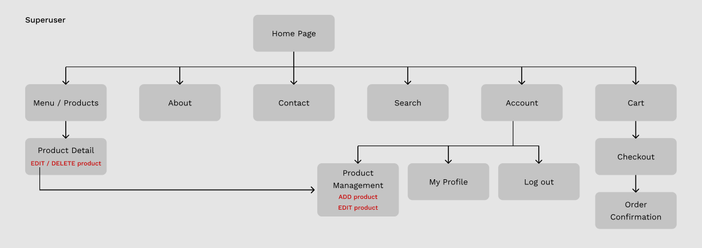
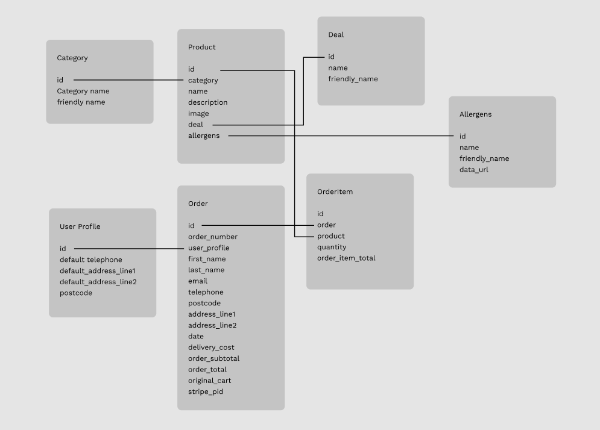

# UNETTO pizza delivery app



[DEMO](https://unetto-pizza.herokuapp.com/)

Unetto is an interactive e-commerce project for a food delivery pizza shop. This project is a fully functioning interactive application that allow users to order and pay food online.

The site provides all the functionality for a common shopping experience, such as: browsing the menu, providing a shopping cart to save chosen items, have a secure checkout payment and have a personalised emailed message. Backed inside the app there are admin, user and database funtionalities.

**Please note:** _This site is purely for educational purposes only. The payments use a real API but remain in test mode, so no real payment will be taken. Please do not enter real credit card details when using this site._

----

### **Contents** ###

- [UX Design](#ux-design)
  - [Project Goals](#project-goals)
  - [User Stories](#user-stories)
    - [Viewing and Navigation](#viewing-and-navigation)
    - [Registration and User Accounts](#registration-and-user-accounts)
    - [Sorting and Searching](#sorting-and-earching)
    - [Purchasing and Checkout](#purchasing-and-checkout)
    - [Admin and Store Management](#admin-and-store-management)
- [Design Choices](#Design-Choices)
  - [Colours](#Colours)
  - [Wireframes](#Wireframes)
- [Technologies](#technologies)
  - [Languages](#languages)
  - [Database](#database)
  - [Libraries](#libraries)
  - [Tools](#tools)
- [Features](#Features)
  - [Features Implemented](#Features-Implemented)
  - [Responsive Front-end Design](#Responsive-Front-end-Design)
  - [Back-end Design](#Back-end-Design)
  - [User Stories Implemented](#User-Stories-Implemented)
  - [Site Construction](#Site-Construction)
    - [Topology](#Topology)
  - [Database Schema](#Database-Schema)
    - [Fixtures JSON File creation](#Fixtures-JSON-File-creation)
  - [CRUD Functionality](#CRUD-Functionality)
  - [Messages](#Messages)
  - [Defensive Programming](#Defensive-Programming)
  - [Additional Site Features](#Additional-Site-Features)
  - [Future Features](#Future-Features)
- [Project Management](#Project-Management)
- [Version Control](#Version-Control)
- [Testing](#Testing)
- [Bugs](#Bugs)
- [Deployment](#deployment)
  - [Cloning Unetto from GitHub](#cloning-unetto-from-github)
    - [Prerequisites](#prerequisites)
    - [Cloning the GitHub repository](#Cloning-the-GitHub-repository)
    - [Creation of a Python Virtual Environment](#Creation-of-a-Python-Virtual-Environment)
    - [Install the App dependencies and external libraries](#Install-the-App-dependencies-and-external-libraries)
    - [Create the database in sqlite3](#Create-the-database-in-sqlite3)
    - [Create .env file](#Create-.env-file)
    - [Run the application locally](#Run-the-application-locally)
  - [Deploying Unetto app to Heroku](#Deploying-Unetto-app-to-Heroku)
    - [Creating the Heroku app](#Creating-the-Heroku-app)
    - [Adding a PostgreSQL database to Heroku](#Adding-a-PostgreSQL-database-to-Heroku)
    - [Load the data into PostgreSQL](#Load-the-data-into-PostgreSQL)
    - [Push your repository to GitHub](#Push-you-repository-to-GitHub)
    - [Launch the app](#Launch-the-app)
- [Credits](#Credits)
  - [Images](#Images)
  - [Colour](#Colour)
  - [Inspiration](#Inspiration)
  - [Acknowledgements](#Acknowledgements)


---

## **UX DESIGN** ##

### **Project Goals** ###    

The **goal** of this project is to build a fully functioning e-commerce website for a delivery pizzeria business, allowing the user to browse and order products to be delivered at home.

The **features** of the website will be:

- Display a Menu or search for products by category, or type.
- Sort items by name or price.
- Inform the user about allergens.
- Select items to purchase, select a quantity, and place the order in the shopping cart.
- Checkout. The user inserts personal detail along with delivery details and pay with a secure transaction. Payment integration with Stripe.
- Registration through a personal user profile, a private user page that shows order history and delivery details.
- Email order confirmation and registration confirmation.

I achieve this by:

- Purchases can be made whether the user is registered with an account or not.
- Each product is associated with a list of allergens, that are linked to external medical informations about their properties. 
- Providing a registration form with username and password for users to create a personal account and relative account page.
- Providing a log in page for existing users.
- Utilising Stripe online payments infrastructure to permit purchasing of products.
- Email functionality are connected with Google Gmail, so that our checkout system send the order confirmation by email.

### **User Stories** ###    

#### Viewing and Navigation ####    

1. As a **shopper**, I want to be able to view a list of products so that I can choose some items to purchase.
2. As a **shopper**, I want to be able to filter products that I am interested in without searching through all the products.
3. As a **shopper**, I want to be able to select individual products to see more detailed information and add the item to my shopping cart.
4. As a **shopper**, I want to be able to see items I have placed in my shopping cart, and keep track of what I am buying.

#### Registration and User Accounts ####

5. As a **site user**, I want to be able to register for an account and save persona informations to speed up future purchases
6. As a **site user**, I want to be able to receive and email to verify my email account and complete the registeration.
7. As a **site user**, I want to be able to save and update my delivery information on my personal profile page.
8. As a **site user**, I want to be able to log in and have a personal profile page containing my delivery details and order history


#### Sorting and Searching ####

9. As a **shopper**, I want to be able to sort the available products by price, category type and name
10. As a **shopper**, I want to be able to see the allergens in the food

#### Purchasing and Checkout ####

11. As a **shopper**, I want to be able to add a product to the shopping cart and select the quantity 
12. As a **shopper**, I want to be able to view the items in my shopping cart, seeing the sub-total, delivery costs and total price.
13. As a **shopper**, I want to be able to update the items in the shopping cart. Change quantities or remove the products from the cart.
14. As a **shopper**, I want to be able to checkout securely, enter my delivery and credit card payment details with no worries.
15. As a **shopper**, I want to be able to view the order confirmation, and receive an email order confirmation letting me know the transaction has succeeded.

#### Admin and Store Management ###

16. As a **store owner**, I want to be able to add new products to my store
17. As a **store owner**, I want to be able to edit product details, uploads a product image file
18. As a **store owner**, I want to be able to delete a product that is no longer for sale.
19. As **Admin**, I want to be able to create and delete categories, deals, list of allergens and products

[Back to contents](#contents)

---

## Design Choices ##


### **Colours** ###

I've chosen worm and light colors. As background site a light bisque and a more white flour tone for each card element. Mainly all the colours have a white, yellow and orange character. I used a strong orange accent color for buttons and element of focus. Green is the color of the logo and the color of basilicum. All this palette draws the color of a pizza!



### **Wireframes** ###

The mock-ups are made using [Figma](https://figma.com/). 
I used rounded corner and smooth compositions. Cards define structural divisions between elements and hierarchies.
I tryed to avoid depth and I used color to diversify the user interaction.

- [Home Page](readme_media/Desktop1.png)
- [User Registration](readme_media/Desktop2.png)
- [User Log In](readme_media/Desktop3.png)
- [Menu Category](readme_media/Desktop4.png)
- [Product Details](readme_media/Desktop5.png)
- [About Page](readme_media/Desktop10.png)
- [Shopping Cart](readme_media/Desktop12.png)
- [Checkout](readme_media/Desktop13.png)
- [Product Management](readme_media/Desktop14.png)

[Back to contents](#contents)

---

## Technologies ##

### **Languages** ###

- [Python3](https://www.python.org/)
  - Used to create the main application functionality
- [HTML5](https://developer.mozilla.org/en-US/docs/Web/HTML)
  - Used as the main markup language for the website content.
- [CSS3](https://developer.mozilla.org/en-US/docs/Web/CSS)
  - Used to style the individual webpages.
- [JavaScript](https://developer.mozilla.org/en-US/docs/Web/JavaScript)
  - Used to create the interactive functionality of the website


### **Database** ###

- [PostgreSQL](https://www.postgresql.org/)
  - A powerful, open-source object-relational database.
- [sqlite3](https://www.sqlitetutorial.net/sqlite-python/)
  - Default database created with Django used for app development on localhost.

### **Libraries / Frameworks** ###

- [Bootstrap5](https://getbootstrap.com/)
  - Used to design a mobile-first responsive website layout.
- [Django](https://www.djangoproject.com/)
  - A high-level Python Web framework.
- [Django-Allauth](https://django-allauth.readthedocs.io/en/latest/overview.html)
  - Python user authentication and login plugin for Django.
- [Stripe](https://stripe.com/en-gb)
  - Online payments platform used for the shopping basket functionality.
- [Green Unicorn (gunicorn)](https://gunicorn.org/)
  - Python WSGI HTTP Server for Unix used on the Heroku deployment.
- [psycopg2-binary](https://pypi.org/project/psycopg2-binary/)
  - PostgreSQL database adapter for Python.
- [Pillow](https://pillow.readthedocs.io/en/stable/)
  - Python Image Library image processing capabilities.
- [Boto3](https://boto3.amazonaws.com/v1/documentation/api/latest/index.html)
  - AWS SDK for Python (Boto3) used to create, configure, and manage AWS S3 services.
- [jQuery](https://jquery.com/)
  - Used for the initialisation of the Bootstrap components functionality and enhance the shopping bag functionality.

### **Tools** ###

- [Git](https://git-scm.com/)
  - Git was used for version control by utilizing the Gitpod terminal to commit to Git and push to GitHub.
- [GitHub](https://github.com/)
  - Used to store, host and deploy the project files and source code after being pushed from Git.
- [Gitpod](https://www.gitpod.io/)
  - An online IDE linked to the GitHub repository used for the majority of the code development.
- [Font-Awesome](https://fontawesome.com/icons?d=gallery)
  - Icon library toolkit
- [Heroku](https://www.heroku.com)
  - Heroku is a platform as a service (PaaS) that enables developers to build, run, and operate applications entirely in the cloud.
- [AWS S3](https://aws.amazon.com/s3/)
  - Amazon Simple Storage Service (Amazon S3) is an object storage service used to store the site static files
- [Django Secret Key Generator](https://miniwebtool.com/django-secret-key-generator/)
  - Used to generate new secret keys for environment variables.
- [Adobe Photoshop](https://www.adobe.com/products/photoshop.html) 
  - Modify photo, resizing, color correction and exporting for web
- [Adobe Illustrator](https://www.adobe.com/products/illustrator.html)
  - Used to create the Unetto logo and favicon

[Back to contents](#contents)

---

### **Site Construction** ##

#### Topology ####

- User Logged Out    


- User Logged In    


- Superuser / Admin Logged In    


### **Existing Features** ###

- Navbar
    - Unetto Icon, and Name logo. 
    - The Bootstrap Navbar is responsive. For small screen size there is a burger icon that opens the lateral menu.
    - Search form integrated in the navbar

    - **For visitors** to the site who are not logged in, is available the list of all the food-products and the links for these pages:
        1. Browse the Menu and all the categories, you can see all products and all single product details page
        2. Order and purchase your food to the delivery. Email confirmation
        3. Log In (form -username -password)
        4. Register (form -username -password -email)
        5. About page
        6. Contact Page

    - **For users** who are logged in: 
        1. Browse the Menu and all the categories, you can see all products and all single product details page
        2. Order and purchase your food to the delivery. Email confirmation
        3. Have a personal page in which you can modify your pesonal detail info and see order history
        4. Log In (form -username -password)
        5. Register (form -username -password -email)
        6. About page
        7. Contact Page

    - **For superusers/admin**
        - Add/Edit/Delete products, access to the product management page
        - In the Admin dashboard is possible to add Categories, Deals and list of Allergens too

### **Database Schema** ###

- Data relationship Diagram, database models    


#### **Fixtures JSON File creation** ####

- I easily loaded my products, categories, deals and allergens into the database using fixtures JSON files. This method is handy when you need to create or remove large quantity of data, because avoid to manually do it by hand for each element via the site admin page.

---

### **CRUD Functionality** ###


| Site Page | Create | Read | Update | Delete |
| --- | --- | --- | --- | --- |
| Menu | | All Products | | |
| Menu | | | | Delete Single Product |
| Product Detail | | Single Product | | |
| Product Detail | | | | Delete Single Product |
| Add Product | Add New Product | | | |
| Edit Product | | Single Product | | |
| Edit Product | | | Update Single Product | |
| Shopping Cart | | All Products | | |
| Shopping Cart | | | Update Product Quantity (Session) | |
| Shopping Cart | | | | Remove Product (Session) |
| Checkout | | All Products | | |
| Checkout | Create Order | | | |
| Checkout | Create Order Items | | | |
| Checkout | | User Delivery Details | | |
| Checkout | | | Update User Details | |
| Checkout | | | Update Product Quantity (Session) | |
| Checkout | | | | Remove Product (Session) |
| Sign Up | Add New User | | | |
| Log In | | User Details | | |
| My Profile | | User Details | | |
| My Profile | | User's Orders | | |
| My Profile | | | Update Delivery Details | |


### **Messages** ###

I used the Django provided session-based messages functionality. The messages framework allows you to temporarily store messages in one request and retrieve them for display in a subsequent request. Every message is tagged with a specific level that determines its priority (e.g., success, info, warning, or error).

- Errors - messages are displayed within the bootstrap Toast and havea a red border on top
- Info - messages are displayed within the bootstrap Toast and havea a blue border on top
- Success - messages are displayed within the bootstrap Toast and havea a green border on top
- Warning - messages are displayed within the bootstrap Toast and havea a yellow border on top


### **Defensive Programming** ###

- Defensive programming is used to prevent "brute force" opening of restricted pages, in order to maintain the site security.
  - Certain pages are removed from view unless a user is authenticated.
  - Python views functions are modified by Django `@login_required` decorators to restrict user access to inappropriate pages.
  - Add/Edit/Remove a products is restricted only to superusers or admins. I ensure this by using if/else conditions to check the user authentication.

### **Future Features** ###

- A system of likes or favorite for each user. Handy for sorting products

- Account user registration using popular social media accounts.

- Add extra ingredients in the selection of products.

[Back to contents](#contents)

---

## Testing ##

- Testing information can be found in a separate [testing.md](testing.md) file.

[Back to contents](#contents)

---

## Version Control ##
- Version control allows you to keep track of your work and helps you to easily explore the changes you have made.
- This repository is hosted by **Github** and the workspace is managed with **Gitpod**.
- Branch **Main** is the dafault branch in Git.

#### Gitpod Workspaces ####
1. In your GitHub repository click on the Gitpod button to start the workspace.
2. Gitpod loads the **online IDE editor** window, you are ready to code.

#### Update Repository ####
- To update the repository inside GitHub, use these commands in the Gitpod terminal
  1. git add .
  2. git commit -m "your commit message"
  3. git push  (default to the master branch)

## Deployment ##

The website was developed using Git pushed to GitHub, which hosts the repository. I deployed the site to Heroku, here the passages:

### **Cloning Unetto** ###

#### **Prerequisites** ###

Ensure you have installed these locally on your computer:

- [Python 3.6 or higher](https://www.python.org/downloads/)
- [PIP3](https://pypi.org/project/pip/) Python package installer
- [Git](https://git-scm.com/) Version Control

*You will also need a [Stripe](https://stripe.com/gb) account in order to use the payment processing for the checkout app.*
*An amazon [AWS](https://aws.amazon.com/) account, and a [s3 bucket](https://docs.aws.amazon.com/AmazonS3/latest/userguide/creating-bucket.html).*

#### **Cloning the GitHub repository** ####

- Navigate to [NicolaLampis/ms4-unetto-pizza](https://github.com/NicolaLampis/ms4-unetto-pizza) GitHub repository.
- click the Code button, then "download zip" to have a copy stored in you machine. 
  - Unzip the repository into the chosen folder, open with your favourite IDE.
- click the Code button, copy the URL.    
- Having Git installed on your system, you can clone the repository with the following command.
```
git clone https://github.com/NicolaLampis/ms4-unetto-pizza
```
- Using your favourite IDE open up your preferred terminal.
- **Navigate** to your desired file location.

#### **Creation of a Python Virtual Environment** ####

*Note: The process may be different depending upon your own OS*
Use this [Python help guide](https://python.readthedocs.io/en/latest/library/venv.html) to understand how to create a virtual environment.

#### **Install the App dependencies and external libraries** ####

- Install all the dependencies listed in the requirements.txt file. In your IDE terminal window run the following command:

```
pip3 install -r requirements.txt
```

#### **Create the database in sqlite3** ####

sqlite3 will be initialized locally after the installaton of the requirements.txt.

Run the following commands to create the database tables:

- Check which migrations will be applied.

```
python3 manage.py migrate --plan

```

- Apply the migrations.

```
python3 manage.py migrate
```

Load the fixtures files into the database in the following order:

```Python
python3 manage.py loaddata categories
python3 manage.py loaddata deals
python3 manage.py loaddata allergens
python3 manage.py loaddata products
```

#### **Create .env file** ####

- Setting up the required environment variables can be achieved in two ways.

  - If you have chosen Visual Studio Code as your IDE, locate the `settings.json` file in the .vscode directory. Navigate to `File`, `Preferences`, `Settings` and  `settings.json` file. Enter the environment variables as follows:

  ```json
      "terminal.integrated.env.linux": {
          "DEVELOPMENT": "True",
          "SECRET_KEY": "<your key here>",
          "STRIPE_PUBLIC_KEY": "<your key here>",
          "STRIPE_SECRET_KEY": "<your key here>",
          "STRIPE_WH_SECRET": "<your key here>",
          "AWS_ACCESS_KEY_ID": "<your key here>",
          "AWS_SECRET_ACCESS_KEY": "<your key here>",
          "AWS_STORAGE_BUCKET_NAME": "<your bucket name here>",
      }
  ```

  - Alternatively, create a file called `env.py` in the root directory of your project.
  - In the `env.py` file, set your environment variables as follows:

  ```python
      import os
      os.environ["AWS_ACCESS_KEY_ID"] = "<your key here>"
      os.environ["AWS_S3_REGION_NAME"] = "<your AWS S3 region name here>
      os.environ["AWS_SECRET_ACCESS_KEY"] = "<your key here>"
      os.environ["AWS_STORAGE_BUCKET_NAME"] = "<your AWS S3 bucket name here>"
      os.environ["SECRET_KEY"] = "<your secret key here>"
      os.environ["STRIPE_PUBLIC_KEY"] = "<your key here>"
      os.environ["STRIPE_SECRET_KEY"] = "<your key here>"
      os.environ["STRIPE_WH_SECRET"] = "<your key here>"
      os.environ["DEVELOPMENT"] = "True"
  ```

- Ensure that your virtual environment is activated
- The Stripe keys can be found in the Developers section under API Keys and Webhooks of your [Stripe Account](https://stripe.com/gb)
- ***Important:*** Add the `.env` file to your `.gitignore` file before pushing your files to any public git repository.


#### **Run the application locally** ####

- To run the application, enter the following command into the terminal window:

```Python
python3 manage.py runserver
```

To access the admin panel, add `/admin` to the end of the app's url in the *browser* and log in using your superuser details

### **Deploying Unetto web app to Heroku** ###

#### **Creating the Heroku app** ####

*Please ensure you have an account created at [Heroku](https://signup.heroku.com/login) in order to deploy the app.*

- Log in to your Heroku account dashboard and create a new app.
- Enter the App name.
- Choose a geographical region closest to where you live.

#### **Adding a PostgreSQL database to Heroku** ####

- Select the **Resources** tab on your Heroku app dashboard
- Select `Heroku Postgres` as a new add-on with a Plan name of `Hobby Dev - Free`
- Heroku will build the PostgresQL database instance and add a config variable automatically.

#### **Load the data into PostgreSQL** ####

- Add the following variable to the `.env` file:
```Python
DATABASE_URL=[YOUR POSTGRESQL DATABASE URL FROM HEROKU CONFIG VARS]
```

- Apply the migrations to the Heroku PostgreSQl database tables.

```Python
python3 manage.py migrate
```

- Load the fixtures files into the PostgreSQL database in the following order:

```Python
python3 manage.py loaddata categories
python3 manage.py loaddata deals
python3 manage.py loaddata allergens
python3 manage.py loaddata products
```

### **Push your repository to GitHub** ###
 - In the Heroku App page, open Settings > Config Vars
 - Add all the environment variables from your local `.env` file into the Heroku Config Vars:

| Key | Value |
--- | ---
SECRET_KEY | <"your key here">
STRIPE_PUBLIC_KEY | <"your key here">
STRIPE_SECRET_KEY | <"your key here">
STRIPE_WH_SECRET | <"your key here">
AWS_ACCESS_KEY_ID | <"your key here">
AWS_SECRET_ACCESS_KEY | <"your key here">
USE_AWS | "True"
EMAIL_HOST_PASS | <"your app password as generated by Gmail for example">
EMAIL_HOST_USER | <"your email address that is used to send emails">

Set also your AWS settings in *settings.py*

- In the Heroku App Deploy page:
  - Select GitHub from the Deployment Method options.
  - Select Connect to GitHub.
  - Log in to your GitHub account from Heroku.
  - Link the Heroku app to the correct GitHub repository for the project
  - Select Connect.
  - Select Enable Automatic Deployment from the GitHub Main/Master branch.
  - Perform a `git push heroku main` to push the project to Heroku for the first time
  - In Heroku > Activity the build process starts.
       
After the successful deployment, click on **Open App** to view the deployed site

[Back to contents](#contents)

---

## Credits ##

### **Inspiration** ##

I used this link for design and layout ideas for pizza website:
- [dribble.com](https://dribbble.com/tags/pizza_website)

### **Images** ###

Most of the images I used were taken from [unsplash.com](https://unsplash.com/), license free to use.
Photo by the artist *amirali-mirhashemian*, Pizza photos and homepage
Photo by the artist *joice-kelly*, Lasgna photos
Photo by the artist *mink-mingle*, Cheesecake photos
Photo by the artist *nik-owens*, Pizza and oven photos
Photo by the artist *juan-manuel-nunez-mendez*, handmaking pizza photos
Photo by the artist *priscilla-du-preez*, tomatoes photos


### **Acknowledgements** ###

- [Code Institute](https://codeinstitute.net/full-stack-software-development-diploma/) Course material - Django Boutique Ado project was source of inspiration
- [Anna Greaves](https://github.com/AJGreaves) code snippets and README.md format ideas 
- [Simon Vardy](https://github.com/simonjvardy) code snippets and README.md format ideas
- [wondrousWebWorks](https://github.com/wondrousWebWorks) code snippets and project ideas
- [Stack Overflow](https://stackoverflow.com/) safe place for every developers in search of answers
- [Django documentation](https://docs.djangoproject.com/en/3.2/) widget, models, forms, admin...
- [W3Schools](https://www.w3schools.com/howto/howto_css_hide_arrow_number.asp) Html and CSS guide
- [Bootstrap v5](https://getbootstrap.com/docs/5.1/getting-started/introduction/) Guide to use the workframe to built a template

## Disclaimer ##
This site is intended for **educational purposes** only, is a submission project for Code Institute.
